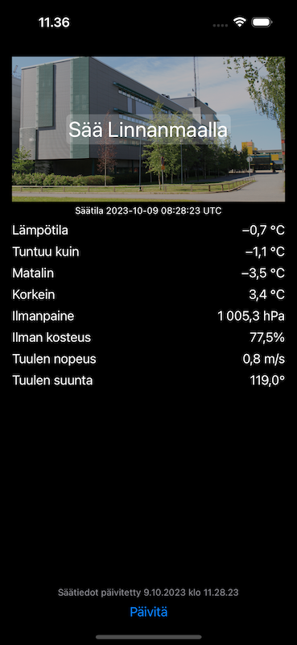

# Linnanmaa Weather app

This app is meant to demonstrate (in a simple way) how to localize an app in an iOS project.

App has English development language and localization files for Finnish and Swedish.

> Please note that the weather service at [weather.willab.fi](http://weather.willab.fi) has not updated since Dec 2022 due to technical problems. Therefore, the weather data is from that date. 
 

